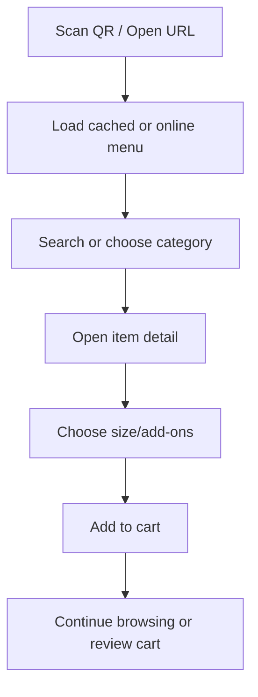
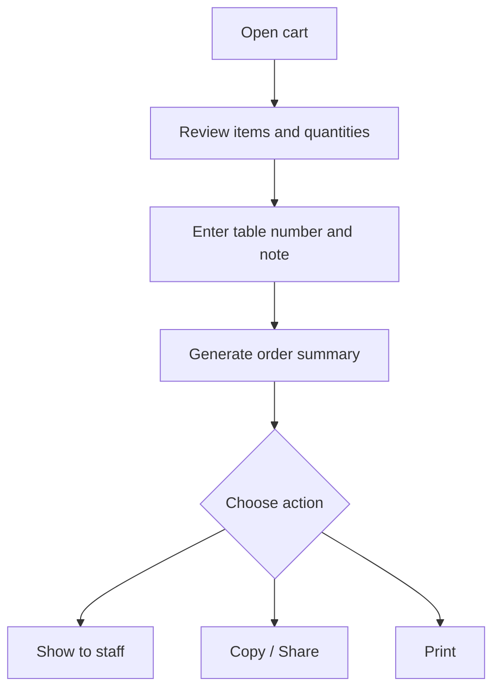
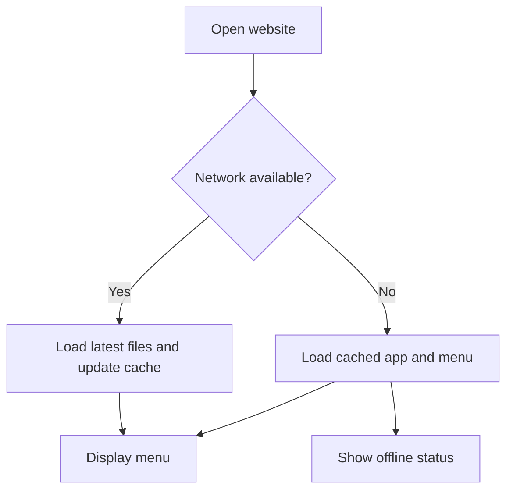

# E‑Menu Local Business — Full Project Specification

**Project name:** `e_menu_local_business`  
**Product type:** Static Responsive Website + Offline‑First Progressive Web App (PWA)  
**Hosting:** GitHub Pages  
**Frontend:** HTML5, CSS3, Bootstrap 5.3, Vanilla JavaScript ES6+  
**Data source:** Local JSON files  
**Primary languages:** Khmer and English  
**Document status:** Implementation-ready specification  

---

## 1. Project Overview

### 1.1 Purpose

បង្កើត E‑Menu សម្រាប់ភោជនីយដ្ឋាន ហាងកាហ្វេ ហាងអាហារ ឬអាជីវកម្មក្នុងតំបន់ ដែលអតិថិជនអាច Scan QR Code រួចមើលមុខម្ហូបបានយ៉ាងឆាប់រហ័ស ស្រស់ស្អាត និងងាយប្រើលើ Mobile, Tablet និង Desktop។

Website ត្រូវដំណើរការជា Static Website លើ GitHub Pages ដោយមិនប្រើ Backend និង Database Server។ បន្ទាប់ពីបើកបានជោគជ័យលើកដំបូង PWA ត្រូវអាចបង្ហាញ App Shell និងទិន្នន័យដែលបាន Cache ទោះគ្មាន Internet ក៏ដោយ។

### 1.2 Product Vision

> ផ្តល់បទពិសោធន៍មើលមុខម្ហូបដូច Mobile App៖ លឿន ស្អាត ងាយស្វែងរក មានពីរភាសា អាច Install និងអាចប្រើបានពេល Internet ខ្សោយ ឬ Offline។

### 1.3 Core Outcomes

- អតិថិជនរកឃើញមុខម្ហូបក្នុងរយៈពេលខ្លី។
- ព័ត៌មានតម្លៃ រូបភាព គ្រឿងផ្សំ និងស្ថានភាពមានលក់បង្ហាញច្បាស់។
- UI ប្រើបានល្អចាប់ពីអេក្រង់ទទឹង `320px` រហូតដល់ Desktop ធំ។
- Menu អាចកែបានដោយកែ JSON និង Push ទៅ GitHub។
- Website អាច Install ជា PWA និងបើកប្រើ Offline បន្ទាប់ពីទិន្នន័យត្រូវបាន Cache។
- Source code រៀបចំជា Module ងាយថែទាំ និងពង្រីកទៅ Backend នៅពេលក្រោយ។

---

## 2. Scope and Constraints

### 2.1 Included in Version 1

- Business profile, logo, cover, address, opening hours និង contact links
- Khmer/English language switching
- Category navigation
- Menu listing with image, name, price, badge and availability
- Search, category filter, dietary filter and sorting
- Menu detail modal/bottom sheet
- Item options, sizes and add-ons
- Favorites saved in `localStorage`
- Cart, quantity control and price calculation
- Table number or customer note
- Order summary with Copy, Share and Print actions
- Light/Dark theme
- Responsive mobile-first interface
- Installable PWA
- Offline cache and update notification
- Loading, empty, error and offline states
- GitHub Pages deployment
- QR Code linking to the deployed URL

### 2.2 Technical Constraints

- GitHub Pages serves only static files; PHP, Laravel, Node server or server-side database are not available.
- First visit and first complete cache require Internet.
- Cart, favorites, language and theme are stored only on the current browser/device.
- Clearing browser data removes local state.
- Order Summary is not automatically sent to kitchen or stored centrally.
- Phone, Telegram, Messenger, Maps and online Share actions require Internet or the related app.
- Source and public JSON data must not contain secrets, private keys, customer data or credentials.

### 2.3 Explicitly Out of Scope

- User login/register
- Admin Dashboard
- Central order history
- Kitchen Display System
- Online payment
- Stock synchronization
- Multi-branch real-time data
- Push notification
- Cloud analytics containing personal information

These features require a later Backend/API phase.

---

## 3. Target Users and Roles

| Role | Goal | Main actions |
|---|---|---|
| Customer | រក និងមើលមុខម្ហូប | Scan QR, Search, Filter, View detail, Favorite, Add to cart |
| Table customer | រៀបចំបញ្ជីកម្ម៉ង់ | Enter table number, adjust quantity, add note, show order summary |
| Business owner | កែ Menu | Edit JSON/images, test, commit and deploy |
| Developer/maintainer | ថែទាំ Website | Update UI, service worker cache, tests and GitHub Pages |

---

## 4. Success Criteria

- Menu content usable without horizontal page scrolling at `320px`.
- All primary actions accessible with one hand on common phone sizes.
- Search or filter response appears within `100ms` for up to 500 local menu items on a typical mid-range phone.
- No broken content when changing Khmer/English or Light/Dark mode.
- Cached version opens without network after one successful complete visit.
- Lighthouse targets on production:
  - Performance: at least 90
  - Accessibility: at least 95
  - Best Practices: at least 95
  - SEO: at least 90
- No uncaught JavaScript errors in supported browsers.
- All acceptance criteria in Section 25 pass before release.

---

## 5. Product Navigation and Screens

The product is a Single Page Application experience without a framework. Sections are rendered and controlled by JavaScript while keeping semantic HTML and normal URL anchors.

### 5.1 Main Screens

1. **Home/Menu**
   - Business header and hero
   - Search
   - Promotion highlights
   - Category chips
   - Menu list

2. **Menu Detail**
   - Large image
   - Khmer/English name
   - Description, price, allergen and dietary information
   - Size/variant and add-on selection
   - Quantity and Add to Cart

3. **Favorites**
   - Saved items
   - Empty state
   - Remove or open detail

4. **Cart**
   - Selected items
   - Quantity and remove controls
   - Note and table number
   - Subtotal, discount display and total

5. **Order Summary**
   - Human-readable item list
   - Table number and note
   - Total
   - Copy, Web Share and Print

6. **Business Information**
   - Address, hours and contact
   - Map link
   - Social channels

7. **Settings**
   - Language
   - Currency display
   - Light/Dark/System theme
   - Install app
   - Clear favorites/cart with confirmation

### 5.2 Mobile Bottom Navigation

Display below `768px`:

- Home
- Menu/Categories
- Favorites
- Cart with quantity badge

The bar must respect `env(safe-area-inset-bottom)` on devices with a home indicator.

### 5.3 Desktop Navigation

Display from `768px`:

- Brand/logo at left
- Home, Menu, About at center/right
- Search, language, theme and cart actions
- Cart opens as a right-side offcanvas panel

---

## 6. User Flows

### 6.1 Browse and Select



### 6.2 Prepare an Order



### 6.3 Offline Flow



---

## 7. Functional Requirements

Priority meanings:

- **Must:** Required for release
- **Should:** Strongly recommended
- **Could:** Optional enhancement

### 7.1 Business Information

| ID | Requirement | Priority |
|---|---|---|
| FR-BUS-001 | Display logo, business name, tagline and cover image | Must |
| FR-BUS-002 | Display address, opening status and daily hours | Must |
| FR-BUS-003 | Provide call, Telegram/Messenger and Maps links when configured | Should |
| FR-BUS-004 | Hide any contact action whose data is empty | Must |
| FR-BUS-005 | Allow theme colors to be configured through CSS variables/business data | Should |

### 7.2 Menu Categories and Items

| ID | Requirement | Priority |
|---|---|---|
| FR-MENU-001 | Load active categories and items from local JSON | Must |
| FR-MENU-002 | Sort categories and items by `sortOrder` | Must |
| FR-MENU-003 | Show item image, localized name, starting price, badges and availability | Must |
| FR-MENU-004 | Support popular, recommended, new, spicy, vegetarian and halal labels | Should |
| FR-MENU-005 | Out-of-stock items remain visible but cannot be added to cart | Must |
| FR-MENU-006 | Open a detail modal/bottom sheet from the item card | Must |
| FR-MENU-007 | Support sizes/variants and optional add-ons | Must |
| FR-MENU-008 | Recalculate displayed price when options change | Must |
| FR-MENU-009 | Use a placeholder when an image fails | Must |
| FR-MENU-010 | Lazy-load non-critical menu images | Must |

### 7.3 Search, Filter and Sort

| ID | Requirement | Priority |
|---|---|---|
| FR-SRC-001 | Search Khmer name, English name, description and keywords | Must |
| FR-SRC-002 | Search must be case-insensitive and trim extra spaces | Must |
| FR-SRC-003 | Debounce search input between 150–250ms | Should |
| FR-SRC-004 | Filter by category | Must |
| FR-SRC-005 | Filter by available, recommended, vegetarian, halal and spicy level | Should |
| FR-SRC-006 | Sort by default order, name, lowest price and highest price | Should |
| FR-SRC-007 | Provide a clear-all action and active filter count | Must |
| FR-SRC-008 | Show an empty state with a reset action when nothing matches | Must |

### 7.4 Favorites

| ID | Requirement | Priority |
|---|---|---|
| FR-FAV-001 | Add/remove an item using a heart action | Must |
| FR-FAV-002 | Persist favorite IDs in `localStorage` | Must |
| FR-FAV-003 | Ignore IDs that no longer exist in menu data | Must |
| FR-FAV-004 | Announce favorite state changes to assistive technology | Should |

### 7.5 Cart and Order Summary

| ID | Requirement | Priority |
|---|---|---|
| FR-CART-001 | Add selected item, variant, add-ons, note and quantity to cart | Must |
| FR-CART-002 | Merge only cart rows with exactly the same item/options/note | Must |
| FR-CART-003 | Increase, decrease and remove cart rows | Must |
| FR-CART-004 | Prevent quantity below 1 or above configured maximum | Must |
| FR-CART-005 | Persist cart state locally with a data schema version | Must |
| FR-CART-006 | Calculate row total, subtotal, configured discount and grand total | Must |
| FR-CART-007 | Format USD/KHR consistently without floating-point display errors | Must |
| FR-CART-008 | Accept table number/name and general order note | Must |
| FR-CART-009 | Generate an order reference locally using date/time plus short random suffix | Should |
| FR-CART-010 | Copy formatted summary to clipboard | Must |
| FR-CART-011 | Use Web Share API when supported and fall back to Copy | Should |
| FR-CART-012 | Provide print-friendly order summary | Should |
| FR-CART-013 | Clear cart only after confirmation | Must |
| FR-CART-014 | Clearly state that the order is not automatically sent | Must |

### 7.6 Language, Currency and Theme

| ID | Requirement | Priority |
|---|---|---|
| FR-SET-001 | Switch between Khmer and English without a page reload | Must |
| FR-SET-002 | Persist selected language | Must |
| FR-SET-003 | Fall back to the other language if one translation is missing | Must |
| FR-SET-004 | Support USD, KHR or dual-price display as configured | Must |
| FR-SET-005 | Support Light, Dark and System theme | Must |
| FR-SET-006 | Persist theme preference and react to system theme changes in System mode | Should |

### 7.7 PWA and Offline

| ID | Requirement | Priority |
|---|---|---|
| FR-PWA-001 | Register a service worker only when supported | Must |
| FR-PWA-002 | Include a valid web app manifest and local app icons | Must |
| FR-PWA-003 | Cache the app shell, data, fonts and required images | Must |
| FR-PWA-004 | Open a useful cached experience without Internet after initial cache | Must |
| FR-PWA-005 | Show online/offline status without blocking the user | Must |
| FR-PWA-006 | Remove old caches during service-worker activation | Must |
| FR-PWA-007 | Notify the user when a new version is ready and allow refresh | Must |
| FR-PWA-008 | Provide an Install action only when installation is supported | Should |
| FR-PWA-009 | Show an offline fallback page if no cached navigation route exists | Must |

---

## 8. UI/UX Design Specification

### 8.1 Design Direction

Style: modern, warm, appetizing, minimal and trustworthy.

- Use food photography as the visual focus.
- Use generous whitespace and clear hierarchy.
- Avoid excessive gradients, shadows and animations.
- Cards must feel tactile but remain lightweight.
- Primary action colors must be consistent.
- Price and availability must be recognizable without opening detail.

### 8.2 Design Tokens

All design values must be CSS custom properties in `variables.css`.

```css
:root {
  --color-primary: #166534;
  --color-primary-hover: #14532d;
  --color-accent: #f59e0b;
  --color-danger: #dc2626;
  --color-success: #15803d;
  --color-bg: #fffdf8;
  --color-surface: #ffffff;
  --color-text: #1f2937;
  --color-text-muted: #6b7280;
  --color-border: #e5e7eb;

  --radius-sm: 0.5rem;
  --radius-md: 0.875rem;
  --radius-lg: 1.25rem;
  --radius-pill: 999px;

  --space-1: 0.25rem;
  --space-2: 0.5rem;
  --space-3: 0.75rem;
  --space-4: 1rem;
  --space-5: 1.5rem;
  --space-6: 2rem;

  --shadow-card: 0 8px 24px rgb(31 41 55 / 0.08);
  --transition-fast: 160ms ease;
}
```

Brand colors can be changed, but final combinations must meet WCAG AA contrast.

### 8.3 Typography

- Khmer: locally hosted `Noto Sans Khmer`
- English/numbers: locally hosted `Inter` or a compatible system font
- Do not load fonts from a CDN.
- Use `font-display: swap`.
- Use responsive typography:

```css
--text-body: clamp(0.9375rem, 0.9rem + 0.2vw, 1rem);
--text-title: clamp(1.5rem, 1.1rem + 2vw, 2.5rem);
```

Typography rules:

- Body line-height: `1.6` for Khmer
- Buttons and labels: medium/semi-bold
- Price: bold with tabular numerals when available
- Never use text smaller than `12px`; normal body target is `15–16px`

### 8.4 Iconography

- Use local Bootstrap Icons or optimized inline SVG.
- Every icon-only button must have `aria-label` and a tooltip/title where useful.
- Icons must not be the only indication for destructive actions.

### 8.5 Motion

- Use subtle `opacity` and `transform` transitions between `150–250ms`.
- Avoid animation that blocks input.
- Skeleton loading may use a soft pulse.
- Respect `prefers-reduced-motion: reduce`.
- No auto-playing carousel.

### 8.6 Touch and Accessibility

- Minimum interactive target: `44 × 44px`.
- Minimum gap between adjacent icon buttons: `8px`.
- Visible keyboard focus using `:focus-visible`.
- All forms must have labels.
- Images must have localized `alt` text; decorative images use `alt=""`.
- Color is not the only signal for availability/error.
- Modal/offcanvas must trap focus and return focus to its trigger after closing.
- Page language attribute must update between `lang="km"` and `lang="en"`.
- Live region announces cart count, filter result count and offline/update status.

---

## 9. Responsive Layout Specification

Bootstrap is mobile-first. Custom CSS must begin with the smallest layout and add `min-width` media queries.

### 9.1 Supported Viewport Ranges

| Range | Target examples | Layout |
|---|---|---|
| `320–359px` | Small Android/iPhone SE-like width | Compact single-column list cards |
| `360–575px` | Common phones | Single-column list cards, bottom navigation |
| `576–767px` | Large phone/small tablet | Two-column cards where content fits |
| `768–991px` | Tablet | Two or three columns, desktop header |
| `992–1199px` | Laptop | Three columns, right cart offcanvas |
| `1200–1399px` | Desktop | Four columns |
| `≥1400px` | Large desktop | Four columns with centered max-width container |

### 9.2 Global Responsive Rules

- `<meta name="viewport" content="width=device-width, initial-scale=1">`
- Main container width: `min(100% - 2rem, 1320px)`.
- At `320px`, horizontal page scrolling is forbidden.
- Use `min-width: 0` for grid/flex children to prevent overflow.
- Long Khmer/English names wrap to two lines; card descriptions clamp to two lines.
- Category chips scroll horizontally with visible continuation; do not wrap into many rows on phone.
- Fixed elements respect safe-area insets.
- Do not use fixed pixel widths for page-level content.
- Use `clamp()` for padding, gap, hero height and type scale.

### 9.3 Mobile Layout

- Header height: approximately `56px`.
- Search control occupies full width.
- Search/filter block may become sticky after hero content.
- Category chips remain horizontally scrollable.
- Menu card at `<576px`:
  - Horizontal layout
  - Image width: `96–120px` using `clamp()`
  - Content uses remaining width
  - Name: maximum two lines
  - Price and add action remain visible
- Detail opens as a near-full-height bottom sheet.
- Cart opens as a full-height or large bottom sheet.
- Primary checkout/order-summary action stays above bottom navigation.

### 9.4 Tablet/Desktop Layout

- Menu cards use vertical image-first layout.
- Image ratio: `4 / 3`.
- Card heights align within each row.
- Search and filters may be displayed in one toolbar.
- Cart opens from the right with width around `400–460px`.
- Business contact details can use a multi-column footer.

### 9.5 Orientation and Zoom

- Support portrait and landscape.
- Do not disable browser zoom.
- At 200% zoom, functionality and content remain accessible.
- Avoid viewport-height-only layouts that hide content behind mobile browser chrome.

---

## 10. Component Specification

### 10.1 App Header

- Logo and localized business name
- Online/offline indicator
- Language selector
- Theme toggle
- Cart count
- Sticky behavior only when it does not cover too much small-screen space

### 10.2 Hero

- Optimized cover image with readable overlay
- Business status: Open/Closed
- Today’s opening hours
- Optional promotion message
- Optional “View menu” action

### 10.3 Search Bar

- Search icon
- Localized placeholder
- Clear button appears when populated
- Filter action with active-count badge
- Keyboard `Escape` clears or closes suggestions

### 10.4 Category Chips

- “All” is first.
- Active category has strong visual state and `aria-current`.
- Chips can be scrolled using touch, trackpad and keyboard.
- Selecting a category updates results without page reload.

### 10.5 Menu Card

- Image with fixed aspect ratio and placeholder fallback
- Badges placed without covering important image content
- Favorite button
- Localized name and short description
- Price or “From $…”
- Availability status
- Quick add only when an item has no required option; otherwise open detail

### 10.6 Item Detail

- Responsive image
- Full description
- Ingredient/allergen information
- Required variant shown as a radio group
- Add-ons shown as checkbox controls
- Inline validation if required selection is missing
- Quantity stepper
- Computed total
- Sticky Add to Cart action on mobile

### 10.7 Cart Item

- Thumbnail and localized name
- Selected variant/add-ons
- Row note
- Quantity stepper
- Row total
- Remove action with accessible label

### 10.8 Toast and Dialog

- Toasts for non-blocking success/status feedback.
- Confirmation dialog for destructive actions.
- Errors requiring correction appear near the related control.
- Never rely only on transient toast for critical errors.

### 10.9 State Components

- Skeleton cards while data loads
- Empty results
- Empty favorites
- Empty cart
- Data load error with Retry
- Offline banner
- New version available banner
- Image placeholder

---

## 11. Data Architecture

### 11.1 Data Files

| File | Responsibility |
|---|---|
| `data/business.json` | Brand, contact, hours, currency and app settings |
| `data/categories.json` | Menu category definitions |
| `data/menu-items.json` | Items, variants, add-ons and flags |
| `data/promotions.json` | Optional static promotions |
| `data/translations.json` | Interface text for Khmer/English |

### 11.2 `business.json` Schema

```json
{
  "schemaVersion": 1,
  "id": "local-cafe",
  "name": {
    "km": "ហាងកាហ្វេក្នុងស្រុក",
    "en": "Local Café"
  },
  "tagline": {
    "km": "រសជាតិឆ្ងាញ់ និងស្រស់ថ្មីរាល់ថ្ងៃ",
    "en": "Fresh flavor every day"
  },
  "logo": "./assets/images/business/logo.webp",
  "cover": "./assets/images/business/cover.webp",
  "contact": {
    "phone": "+85500000000",
    "telegramUrl": "",
    "messengerUrl": "",
    "mapUrl": ""
  },
  "address": {
    "km": "ក្រុងសៀមរាប ប្រទេសកម្ពុជា",
    "en": "Siem Reap, Cambodia"
  },
  "openingHours": [
    {
      "day": "monday",
      "closed": false,
      "open": "07:00",
      "close": "21:00"
    }
  ],
  "currency": {
    "default": "USD",
    "displayMode": "dual",
    "usdToKhr": 4100,
    "khrRounding": 100
  },
  "features": {
    "cart": true,
    "favorites": true,
    "darkMode": true,
    "installPrompt": true
  },
  "order": {
    "maxQuantityPerRow": 20,
    "requireTableNumber": false
  }
}
```

`usdToKhr` is a static business setting, not a live exchange rate. The owner must update it manually.

### 11.3 `categories.json` Schema

```json
[
  {
    "id": "rice",
    "slug": "rice",
    "name": {
      "km": "បាយ",
      "en": "Rice"
    },
    "icon": "bowl-hot",
    "image": "./assets/images/categories/rice.webp",
    "sortOrder": 10,
    "active": true
  }
]
```

### 11.4 `menu-items.json` Schema

```json
[
  {
    "id": "beef-fried-rice",
    "sku": "RICE-001",
    "categoryId": "rice",
    "name": {
      "km": "បាយឆាសាច់គោ",
      "en": "Beef Fried Rice"
    },
    "description": {
      "km": "បាយឆាជាមួយសាច់គោ បន្លែ និងគ្រឿងទេស",
      "en": "Fried rice with beef, vegetables and seasoning"
    },
    "keywords": ["beef", "rice", "បាយ", "សាច់គោ"],
    "image": "./assets/images/menu/beef-fried-rice.webp",
    "gallery": [],
    "basePrice": {
      "currency": "USD",
      "amount": 3.5
    },
    "variants": [
      {
        "id": "regular",
        "name": {
          "km": "ធម្មតា",
          "en": "Regular"
        },
        "priceDelta": 0,
        "default": true,
        "available": true
      },
      {
        "id": "large",
        "name": {
          "km": "ធំ",
          "en": "Large"
        },
        "priceDelta": 1,
        "default": false,
        "available": true
      }
    ],
    "addOns": [
      {
        "id": "fried-egg",
        "name": {
          "km": "ពងទាចៀន",
          "en": "Fried egg"
        },
        "price": 0.75,
        "available": true
      }
    ],
    "flags": {
      "available": true,
      "recommended": true,
      "popular": true,
      "new": false,
      "vegetarian": false,
      "halal": false
    },
    "spicyLevel": 1,
    "allergens": ["egg", "soy"],
    "sortOrder": 10,
    "updatedAt": "2026-07-29"
  }
]
```

### 11.5 Data Validation Rules

- Every ID must be a unique lowercase slug.
- Every active menu item must reference an existing active category.
- At least one localized name is required.
- Price and price delta cannot be negative.
- `spicyLevel` must be an integer from 0 to 3.
- Image paths must be relative and resolve on GitHub project pages.
- Exactly one available variant should be default when variants exist.
- Out-of-stock add-ons and variants cannot be selected.
- Unknown properties may be ignored for forward compatibility.
- Invalid records must be skipped and logged without crashing the complete menu.

### 11.6 Local Storage Contract

Use namespaced and versioned keys:

| Key | Value |
|---|---|
| `emenu:v1:language` | `"km"` or `"en"` |
| `emenu:v1:theme` | `"light"`, `"dark"` or `"system"` |
| `emenu:v1:currency` | `"USD"`, `"KHR"` or `"dual"` |
| `emenu:v1:favorites` | JSON array of item IDs |
| `emenu:v1:cart` | Versioned cart object |
| `emenu:v1:table` | Table number/name |

Malformed local data must be safely reset to defaults using `try/catch` and schema checks.

---

## 12. Frontend Architecture

### 12.1 Architecture Principles

- Feature-oriented JavaScript modules
- One responsibility per module
- Pure functions for filtering, pricing and formatting
- DOM access isolated in UI/render modules
- Central application state with controlled update functions
- Event delegation for repeated cards
- No inline `onclick`, inline CSS or global mutable variables
- Progressive enhancement: essential business/menu content shows a useful error if JavaScript fails

### 12.2 Module Responsibilities

| Module | Responsibility |
|---|---|
| `app.js` | Bootstrap application, register listeners and start modules |
| `config.js` | Paths and immutable defaults |
| `api/local-data-source.js` | Fetch and validate local JSON |
| `state/store.js` | Central in-memory state and subscriptions |
| `features/menu/menu-service.js` | Search, filter and sort |
| `features/menu/menu-view.js` | Render categories, cards and details |
| `features/cart/cart-service.js` | Add, merge, quantity and totals |
| `features/cart/cart-view.js` | Cart and order summary UI |
| `features/favorites/favorites-service.js` | Favorite persistence |
| `features/settings/settings-service.js` | Theme, language and currency |
| `pwa/pwa-manager.js` | Service worker, install and update UI |
| `shared/storage.js` | Safe localStorage wrapper |
| `shared/i18n.js` | Translation resolution and fallbacks |
| `shared/currency.js` | Integer-safe price calculation/formatting |
| `shared/dom.js` | Safe reusable DOM helpers |

### 12.3 State Shape

```js
{
  business: null,
  categories: [],
  menuItems: [],
  promotions: [],
  filters: {
    query: "",
    categoryId: "all",
    availableOnly: false,
    dietary: [],
    spicyLevels: [],
    sort: "default"
  },
  settings: {
    language: "km",
    currency: "dual",
    theme: "system"
  },
  favorites: [],
  cart: {
    schemaVersion: 1,
    rows: [],
    table: "",
    note: ""
  },
  network: {
    online: true
  }
}
```

### 12.4 Price Calculation

- Convert money to integer minor units before calculation.
- USD uses cents.
- KHR uses whole riel and applies configured rounding.
- Row total:

```text
(base price + variant delta + sum of add-ons) × quantity
```

- Never calculate financial display directly with repeated floating-point addition.

---

## 13. Project Folder Structure

```text
e_menu_local_business/
├── index.html
├── offline.html
├── 404.html
├── manifest.webmanifest
├── service-worker.js
├── precache-manifest.js
├── .nojekyll
├── README.md
├── LICENSE
├── data/
│   ├── business.json
│   ├── categories.json
│   ├── menu-items.json
│   ├── promotions.json
│   └── translations.json
├── assets/
│   ├── css/
│   │   ├── bootstrap.min.css
│   │   ├── variables.css
│   │   ├── base.css
│   │   ├── layout.css
│   │   ├── components.css
│   │   ├── utilities.css
│   │   └── print.css
│   ├── js/
│   │   ├── app.js
│   │   ├── config.js
│   │   ├── api/
│   │   │   └── local-data-source.js
│   │   ├── state/
│   │   │   └── store.js
│   │   ├── features/
│   │   │   ├── menu/
│   │   │   │   ├── menu-service.js
│   │   │   │   └── menu-view.js
│   │   │   ├── cart/
│   │   │   │   ├── cart-service.js
│   │   │   │   └── cart-view.js
│   │   │   ├── favorites/
│   │   │   │   └── favorites-service.js
│   │   │   └── settings/
│   │   │       └── settings-service.js
│   │   ├── pwa/
│   │   │   └── pwa-manager.js
│   │   └── shared/
│   │       ├── currency.js
│   │       ├── dom.js
│   │       ├── i18n.js
│   │       ├── storage.js
│   │       └── validators.js
│   ├── vendor/
│   │   ├── bootstrap/
│   │   │   └── bootstrap.bundle.min.js
│   │   └── bootstrap-icons/
│   ├── fonts/
│   │   ├── noto-sans-khmer.woff2
│   │   └── inter.woff2
│   └── images/
│       ├── business/
│       ├── categories/
│       ├── menu/
│       ├── placeholders/
│       └── icons/
├── tests/
│   ├── manual-test-checklist.md
│   └── test-data/
└── docs/
    ├── content-update-guide.md
    └── deployment-guide.md
```

All application URLs must be relative (`./assets/...`, `./data/...`) so the site works at `https://username.github.io/repository-name/`.

---

## 14. PWA and Offline Architecture

### 14.1 Secure Context

- Production must use HTTPS.
- Local PWA testing must run on `localhost`.
- Do not test PWA by double-clicking `index.html` with a `file://` URL.

### 14.2 Manifest Requirements

`manifest.webmanifest` must include:

- `id`
- `name`
- `short_name`
- `description`
- `start_url: "./"`
- `scope: "./"`
- `display: "standalone"`
- `background_color`
- `theme_color`
- `lang`
- Icons: at least `192×192` and `512×512`
- Maskable icon
- Optional screenshots for richer install UI

### 14.3 Caching Strategy

| Resource | Strategy | Reason |
|---|---|---|
| HTML/app shell | Network-first with cached fallback | Receive updates while remaining offline |
| Versioned CSS/JS/fonts | Cache-first | Stable and fast |
| JSON data | Stale-while-revalidate | Immediate cached menu plus background update |
| Menu images | Cache-first with runtime cache | Reduce repeated bandwidth |
| Offline page | Precache | Guaranteed fallback |
| External URLs | Do not cache | Keep service-worker scope safe |

To guarantee a complete offline menu, all required data and core images must appear in `precache-manifest.js`. A maintenance script may generate the list, but the deployed result must be static.

### 14.4 Cache Lifecycle

- Cache names include an application version, for example `emenu-static-v1`.
- `install`: precache required files.
- `activate`: remove caches not matching the current version.
- `fetch`: apply resource-specific strategies.
- Update cache version when any critical HTML, CSS, JS, JSON or pre-cached image changes.
- If install precaching fails, log the exact failed resource and keep the existing version usable.

### 14.5 Update Experience

- New service worker waits until ready.
- Display localized “New menu version available” banner.
- User selects Update/Refresh.
- The page reloads only after the new worker becomes active.
- Never refresh unexpectedly while the customer is editing cart notes.

### 14.6 Offline UX

- Show a small non-blocking offline banner.
- Keep search, filters, favorites and cart usable.
- Disable or label actions that require network.
- Show the last cached content rather than a blank screen.
- If content has never been cached, show `offline.html` with Retry.

---

## 15. Performance Specification

### 15.1 Asset Budgets

- Initial compressed HTML + critical CSS + JS target: under `250KB`, excluding images/fonts.
- Above-the-fold hero image: preferably under `180KB`.
- Menu thumbnails: preferably `40–120KB` each depending on dimensions.
- Use WebP; optionally provide AVIF with WebP fallback.
- Avoid images larger than their maximum rendered dimensions.
- Self-host only font weights actually used.

### 15.2 Loading Strategy

- Critical CSS loads first.
- Bootstrap and app JavaScript use `defer` or ES modules.
- First visible image can use `fetchpriority="high"` when appropriate.
- Non-critical menu images use `loading="lazy"` and `decoding="async"`.
- Set explicit image `width`, `height` or `aspect-ratio` to prevent layout shift.
- Use `srcset` and `sizes` for materially different image sizes.
- Avoid rendering all 500 items at once; add “Load more” or lightweight pagination above a configurable threshold.

### 15.3 Runtime Efficiency

- Cache filtered results only when useful.
- Use event delegation instead of a listener for every card.
- Batch DOM updates with `DocumentFragment`.
- Avoid layout thrashing.
- Revoke temporary object URLs if introduced.

---

## 16. Accessibility Requirements

Target: WCAG 2.2 AA for core flows.

- Semantic landmarks: `header`, `nav`, `main`, `section`, `footer`.
- One clear page-level `h1`; logical heading order.
- Skip-to-content link.
- Keyboard access to every action.
- Visible focus.
- Contrast ratio at least 4.5:1 for normal text and 3:1 for large text/UI boundaries where applicable.
- Form error text connected using `aria-describedby`.
- Modal names and descriptions exposed correctly.
- Cart count change announced using `aria-live="polite"`.
- Status messages must not steal focus.
- Touch targets meet minimum size.
- Reduced-motion mode supported.
- Content remains usable at 200% browser zoom.

---

## 17. SEO and Social Sharing

- Unique localized `<title>` and description.
- Open Graph image stored locally and referenced using the production absolute URL.
- Favicon and app icons.
- Canonical URL after production domain is known.
- JSON-LD using an appropriate local business/restaurant schema.
- Meaningful image alt text.
- `robots.txt` and `sitemap.xml` may be added after the final public URL is known.
- Do not claim ordering/payment capability in metadata if the site only prepares an order summary.

---

## 18. Security and Privacy

- No secrets, tokens or private data in repository files.
- Treat JSON strings as untrusted content and render using `textContent`, not unsanitized `innerHTML`.
- Validate URL protocols before assigning dynamic links.
- External links use `rel="noopener noreferrer"` when opened in a new tab.
- Pin vendor versions and keep license notices.
- Do not store sensitive customer information.
- Cart/table note is local-only and must be described as such.
- Add a strict Content Security Policy through a `<meta http-equiv>` where compatible with required assets.
- GitHub Pages content is public; repository history may retain removed data.

---

## 19. Error Handling

| Error | Required behavior |
|---|---|
| Business JSON fails | Show branded generic header plus retry; do not crash |
| Categories fail | Show all valid items under a fallback “Menu” category |
| Menu JSON fails online | Retry, then use cache if available |
| Menu JSON fails without cache | Show offline/error state and Retry |
| Image fails | Replace with local placeholder |
| Corrupt localStorage | Reset only the corrupt key and continue |
| Clipboard denied | Select/show text and instruct user to copy manually |
| Web Share unavailable | Hide Share and keep Copy |
| Service worker fails | Website remains usable online |
| Invalid menu record | Skip record, log warning in development |

User-facing errors must be short, localized and actionable.

---

## 20. Coding Standards

### HTML

- Semantic HTML5.
- Valid IDs and unique form labels.
- No inline event handlers.
- Accessible dialog and navigation markup.

### CSS

- Mobile-first.
- CSS custom properties for tokens.
- Component-based class naming.
- Avoid `!important` except documented utility overrides.
- Keep Bootstrap customization in project styles, not edited vendor files.

### JavaScript

- ES modules and strict mode behavior.
- `const` by default; `let` only when reassignment is needed.
- Async operations use `async/await` with error handling.
- Pure calculation/filter functions must be testable without DOM.
- No unhandled promise rejections.
- JSDoc for public functions and complex data structures.

### Content

- All user-visible interface strings live in `translations.json`.
- Menu content lives only in data JSON, not duplicated in HTML.
- File names use lowercase kebab-case.
- Compress images before committing.

---

## 21. Testing Strategy

### 21.1 Functional Tests

- Load valid data and render categories/items.
- Search in Khmer and English.
- Combine category and dietary filters.
- Sort by price.
- Open details and validate required options.
- Add identical/different configurations to cart.
- Update quantity and totals.
- Persist/recover cart, favorites, language and theme.
- Generate order summary.
- Copy, share fallback and print.
- Handle unavailable item/variant/add-on.

### 21.2 Responsive Test Matrix

Test exact widths:

- `320px`
- `360px`
- `375px`
- `390px`
- `412px`
- `430px`
- `576px`
- `768px`
- `1024px`
- `1280px`
- `1440px`

For every width verify:

- No horizontal page overflow
- Text does not overlap
- Cart and bottom navigation do not hide content
- Modal/offcanvas fits the viewport
- Touch actions remain usable
- Portrait and landscape work

### 21.3 Browser/Device Coverage

- Latest stable Chrome on Android
- Safari on current and previous major iOS
- Samsung Internet
- Chrome, Edge, Firefox and Safari desktop

Progressive capabilities may vary; unsupported install/share features must degrade gracefully.

### 21.4 Offline/PWA Tests

1. Clear site data.
2. Open production site online.
3. Wait for complete cache status.
4. Navigate and open several details.
5. Enable offline mode.
6. Reload and verify menu, fonts, images and cart.
7. Deploy a changed cache version.
8. Verify update banner and controlled reload.
9. Confirm old cache removal.

### 21.5 Accessibility Tests

- Keyboard-only navigation
- Screen-reader smoke test
- Automated audit using Lighthouse/axe
- 200% zoom
- Dark mode contrast
- Reduced motion
- Missing-image alt behavior

---

## 22. GitHub Pages Deployment

### 22.1 Repository

Recommended repository name: `e_menu_local_business`.

### 22.2 Deployment Flow

1. Create a GitHub repository.
2. Commit all static files.
3. Include `.nojekyll` in the publishing root.
4. Push to `main`.
5. Open **Settings → Pages**.
6. Select **Deploy from a branch**.
7. Select `main` and `/(root)`.
8. Save and wait for the production URL.
9. Enable HTTPS.
10. Test every relative path from the final project URL.
11. Run Lighthouse and offline testing on production.
12. Generate a QR Code using the final URL.

### 22.3 Required Path Rule

Do not use root-absolute links such as:

```text
/assets/css/style.css
```

Use repository-safe relative links:

```text
./assets/css/style.css
```

This prevents failures when hosted below `/repository-name/`.

### 22.4 Release Versioning

Use semantic-style releases:

- `v1.0.0`: first production release
- Patch: content or bug fix
- Minor: backward-compatible feature
- Major: state/data schema change requiring migration

Create a Git tag for stable releases.

---

## 23. Content Update Workflow

### Add a New Item

1. Prepare a correctly cropped WebP image.
2. Add the image under `assets/images/menu/`.
3. Add the item record to `data/menu-items.json`.
4. Validate unique ID, category, prices and translations.
5. Add the image path to the precache manifest if full offline availability is required.
6. Increment the service-worker cache version.
7. Test locally through `localhost`.
8. Commit and push.
9. Verify the production update prompt and new item.

### Mark Out of Stock

- Set `flags.available` to `false`.
- Update the cache version.
- Deploy and verify that Add to Cart is disabled.

### Change Price

- Change `basePrice`, `priceDelta` or add-on `price`.
- Test USD/KHR formatting and cart totals.
- Increment cache version and deploy.

---

## 24. Implementation Phases

### Phase 1 — Foundation

- Repository and folder structure
- Base HTML
- CSS tokens, fonts and Bootstrap local assets
- JSON schemas and sample content
- App bootstrap and data loader

### Phase 2 — Menu Experience

- Header, hero and business status
- Categories
- Search/filter/sort
- Menu cards
- Detail modal/bottom sheet

### Phase 3 — Personalization and Cart

- Language, currency and theme
- Favorites
- Variants/add-ons
- Cart, notes and totals
- Copy/share/print summary

### Phase 4 — PWA

- Manifest and icons
- Service worker and cache strategies
- Offline states
- Install and update experience

### Phase 5 — Quality

- Responsive refinement
- Accessibility
- Performance optimization
- Error handling
- Cross-browser and offline tests

### Phase 6 — Release

- Documentation
- GitHub Pages configuration
- Production audit
- QR Code
- `v1.0.0` tag

---

## 25. Acceptance Criteria / Definition of Done

### Product

- [ ] Business identity, hours and available contact actions display correctly.
- [ ] Active categories and valid items load from JSON.
- [ ] Khmer/English switching updates the entire interface.
- [ ] Search, filters, sort and reset work together.
- [ ] Item details display variants, add-ons, allergens and availability.
- [ ] Favorites remain after reload.
- [ ] Cart rows and totals remain correct after reload.
- [ ] Table number and notes appear in order summary.
- [ ] Copy works; Share gracefully falls back; Print layout is readable.
- [ ] The UI clearly says the order has not been automatically submitted.

### Responsive UI

- [ ] No horizontal page scrolling from `320px` through `1440px`.
- [ ] Mobile bottom navigation respects safe-area insets.
- [ ] All controls are reachable and at least `44 × 44px` where applicable.
- [ ] Text, images, prices and badges never overlap.
- [ ] Modals/offcanvas work in portrait, landscape and with mobile keyboard open.
- [ ] Light and dark themes are both polished and readable.

### Offline/PWA

- [ ] Manifest passes browser validation.
- [ ] App can be installed in supported browsers.
- [ ] Cached menu opens after network is disabled.
- [ ] Khmer fonts and required images are available offline.
- [ ] Old caches are removed.
- [ ] New deployment presents a controlled update prompt.
- [ ] Site still works online when service worker is unsupported.

### Quality

- [ ] HTML has no critical validation errors.
- [ ] Console has no uncaught errors.
- [ ] Invalid JSON records do not crash the application.
- [ ] Keyboard navigation and visible focus work.
- [ ] Lighthouse targets are met on production or exceptions are documented.
- [ ] README, content update guide and deployment guide are complete.

---

## 26. Future Expansion

When the business needs centralized management, preserve the current UI and replace the local data source with an API:

- Laravel REST API + MySQL
- Laravel Sanctum authentication
- React/Vue Admin Dashboard
- Real-time orders and Kitchen Display
- Inventory and out-of-stock synchronization
- Customer/order history
- Promotion scheduling
- Branch management
- Payment integration
- Analytics

The frontend `local-data-source.js` abstraction must make this replacement possible without rewriting menu UI components.

---

## 27. Recommended Implementation Notes

- Prefer Vanilla JavaScript for Version 1; React/Vue would add unnecessary build complexity for this static scope.
- Keep Bootstrap CSS/JS and fonts inside the repository for offline operation.
- Keep business content separate from interface translations.
- Use realistic Khmer content during development; placeholder Latin text will not reveal Khmer wrapping issues.
- Test on a real low/mid-range Android phone and an iPhone, not only browser device emulation.
- Optimize food images carefully because they are the largest performance and cache cost.
- Document every step required for a non-developer owner to edit JSON safely.

---

## 28. Official Implementation References

- [GitHub Pages overview](https://docs.github.com/en/pages/getting-started-with-github-pages/what-is-github-pages)
- [Configure a GitHub Pages publishing source](https://docs.github.com/en/pages/getting-started-with-github-pages/configuring-a-publishing-source-for-your-github-pages-site)
- [Bootstrap mobile-first introduction](https://getbootstrap.com/docs/5.3/getting-started/introduction/)
- [Bootstrap breakpoints](https://getbootstrap.com/docs/5.3/layout/breakpoints/)
- [MDN: Using service workers](https://developer.mozilla.org/en-US/docs/Web/API/Service_Worker_API/Using_Service_Workers)
- [MDN: PWA caching strategies](https://developer.mozilla.org/en-US/docs/Web/Progressive_web_apps/Guides/Caching)
- [MDN: Making PWAs installable](https://developer.mozilla.org/en-US/docs/Web/Progressive_web_apps/Guides/Making_PWAs_installable)
- [web.dev: Web app manifest](https://web.dev/learn/pwa/web-app-manifest)
- [web.dev: Responsive images](https://web.dev/learn/design/responsive-images)
- [web.dev: PWA checklist](https://web.dev/articles/pwa-checklist)

---

## 29. Final Delivery Checklist

The final project delivery must contain:

- Complete source code
- All local vendor assets, fonts, images and icons
- Valid JSON content
- PWA manifest and icons
- Service worker and cache manifest
- Responsive UI for the complete test matrix
- Manual test checklist
- Content update guide
- Deployment guide
- README with local run and GitHub Pages steps
- Production URL
- QR Code
- Stable release tag

This specification defines a complete, attractive and practical static E‑Menu product while keeping a clear upgrade path to a future Laravel-powered system.
